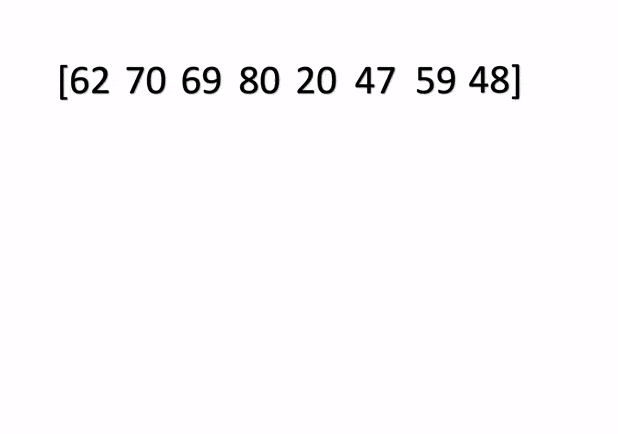

# sort-method-in-c
The process of Sorting can be explained as a technique of rearranging the elements in any particular order, which can be set ready for further processing by the program logic. In C programming language, there are multiple sorting algorithms available, which can be incorporated inside the code. The various types of sorting methods possible in the C language are Bubble sort, Selection sort, Quick sort and Insertion sort.

## Types of Sorting in C
| Method         | Worst-case | Best-case | Performance | Space complexity | Note | Code |
|----------------|------------|-----------|-------------|------------------|------|------|
| Bubble sort    |    O(n^2)   |     O(n)      |      Stable       |        O(1)          |   n小比較好。   |   [Code](https://github.com/andy6804tw/sort-method-in-c/blob/main/Bubble%20sort.c)   |
| Selection sort |     O(n^2)       |    O(n)        |     Unstable        |      O(1)            |   n小較好，部份排序好更好。   |   [Code](https://github.com/andy6804tw/sort-method-in-c/blob/main/Selection%20sort.c)   |
| Insertion sort |     O(n^2)       |     O(n)       |      Stable       |        O(1)          |   大部份排序好比較好。   |   [Code](https://github.com/andy6804tw/sort-method-in-c/blob/main/Insertion%20sort.c)   |
| Quick sort     |     O(n^2)       |           |    Unstable         |       O(n)~O(log n)      |   在資料已排序好時會產生最差狀況。   |   [Code](https://github.com/andy6804tw/sort-method-in-c/blob/main/Quick%20sort.c)   |

## Bubble Sort 氣泡排序
- 兩兩比對交換, 皆在原空間處理, 故只需交換時的一個暫存空間, 因此空間複雜度是O(1) ,時間複雜度O(n2).
- 相同鍵值時, 兩者並不會交換, 仍維持原次序, 故為穩定.

## Insertion Sort 插入排序
做法上是將原空間視為兩部份, 左邊是已排好元素, 右邊是待排元素, 每次從右邊取走一個元素, 到左邊找出應插入位置插入, 只需搬移時的一個暫存空間, 故空間複雜度是O(1) ,時間複雜度O(n2).

## Selection Sort 選擇排序
- 找出最大鍵值的元素調到最後面, 只需一個用來暫存目前最大鍵值的元素空間, 故空間複雜度是O(1),時間複雜度O(n2).

## Quick Sort 快速排序
- 找一個元素, 將所有元素分成鍵值比它小與比它大的兩堆, 然後遞迴排好這兩堆,並且每次有個樞紐值(pivot)左右分堆. 這個分堆的動作, 形成O(n)的空間複雜度,時間複雜度O(nlog2n)

